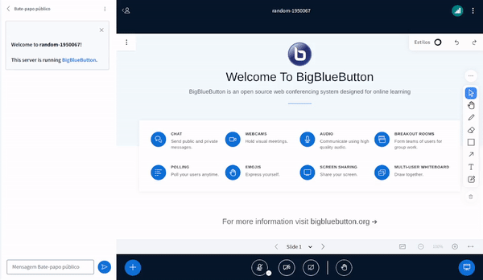

# Sample Microphone Dropdown Plugin

## What is it?

The Sample Microphone Dropdown Plugin serves as a demonstration of how developers can create their own custom plugins, in this case it goes into the microphone dropdown. This plugin includes a separator and an option for the user to click with the label "Click to send alert message". When the user click on the option, an alert popup with the message "Alert popup for plugin". See example below.



## Running the Plugin from Source

1. Start the development server:

```bash
cd $HOME/src/bigbluebutton-html-plugin-sdk/samples/sample-microphone-dropdown-plugin
npm install
npm start
```

2. Add reference to it on BigBlueButton's `settings.yml`:

```yaml
  plugins:
    - name: SampleMicrophoneDropdownPlugin
      url: http://127.0.0.1:4701/static/SampleMicrophoneDropdownPlugin.js
```

## Building the Plugin

To build the plugin for production use, follow these steps:

```bash
cd $HOME/src/bigbluebutton-html-plugin-sdk/samples/sample-microphone-dropdown-plugin
npm install
npm run build-bundle
```

The above command will generate the `dist` folder, containing the bundled JavaScript file named `SampleMicrophoneDropdownPlugin.js`. This file can be hosted on any HTTPS server.

To use the plugin with BigBlueButton, add the plugin's URL to `settings.yml` as shown below:

```yaml
public:
  app:
    ... // All app configurations
  plugins:
    - name: SampleMicrophoneDropdownPlugin
      url: <<PLUGIN_URL>>
  ... // All other configurations
```

Alternatively, you can host the bundled file on the BigBlueButton server by copying `dist/SampleMicrophoneDropdownPlugin.js` to the folder `/var/www/bigbluebutton-default/assets/plugins`. In this case, the `<<PLUGIN_URL>>` will be `https://<your-host>/plugins/SampleMicrophoneDropdownPlugin.js`.
